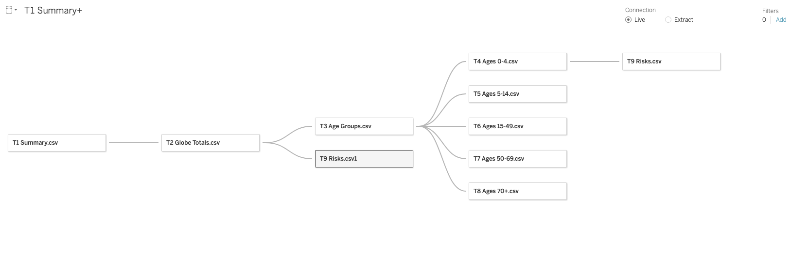
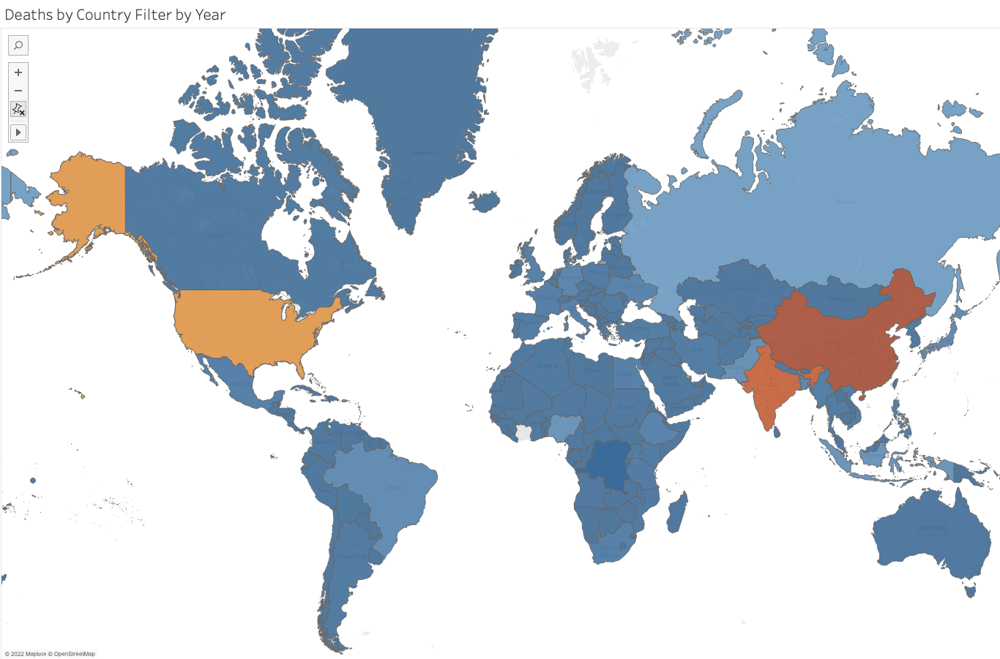
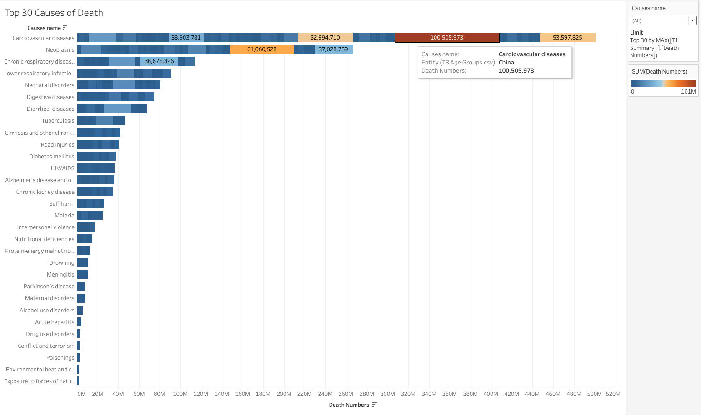
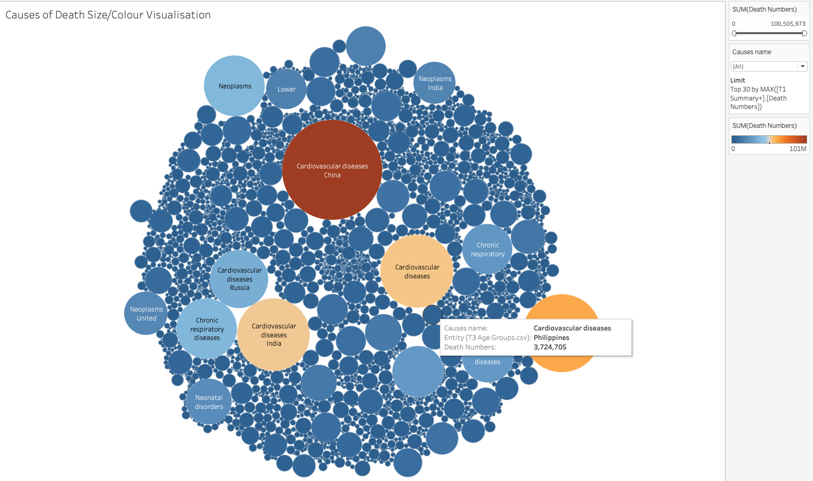
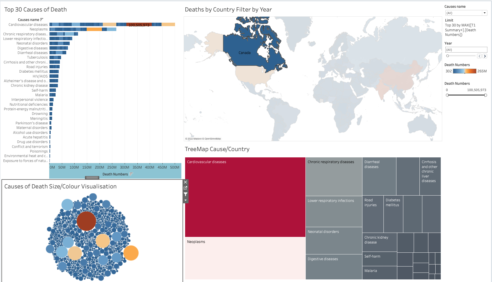
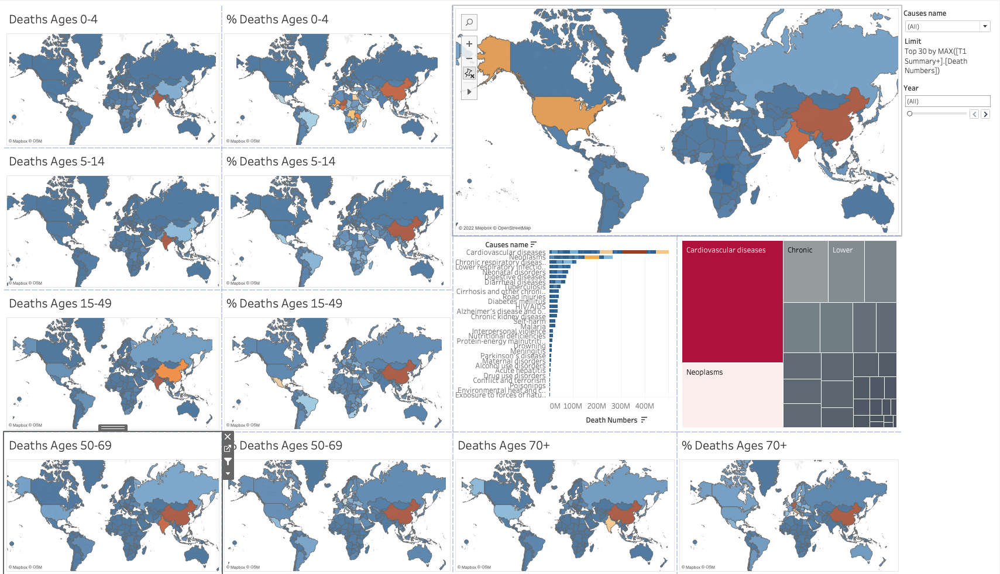
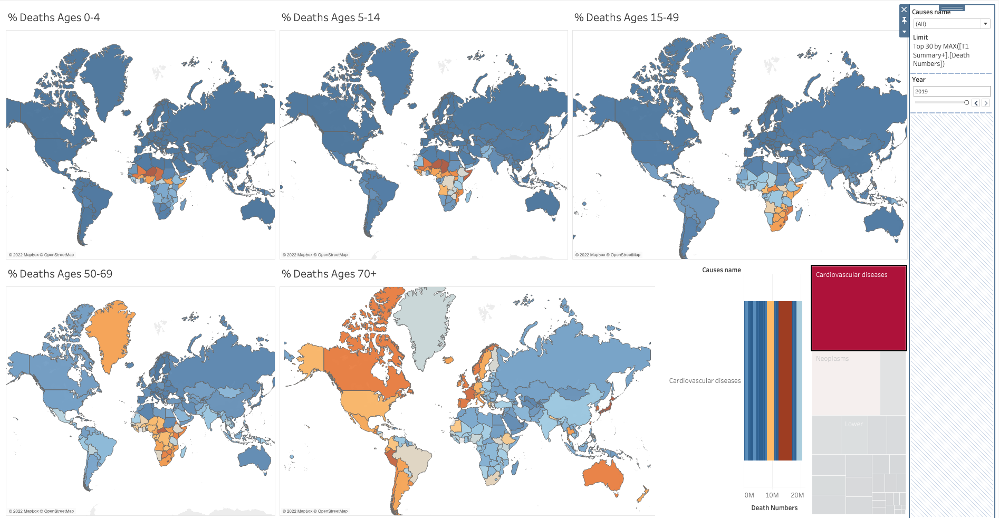

# Global Mortality Distributions by Age Groups - Our World In Data

Jamie Dormaar

[Lighthouse Labs Private Career College](https://www.lighthouselabs.ca/en).

Data Visualization and Dashboards with Tableau

Dec 9th, 2022

---

## Project Goals

- Acquire additional data for more age related detail and potentially unique or surprising insights [(2)](#ref).
- Download, familiarize, clean, and transform the data provided [(1)](#ref) and acquired [2-8](#ref)
- Utilize Tableau software specialized in generating interactive professional dashboard to generate key insights from a clear and effective interactive visualizations.
- Present discovered insights effectively with highly informative, yet intuitive and esthetic visualizations.

<!--
(fill in your description and goals here)
-->

## Introduction

I chose to expand on the project assignment (see [Workbook](./Workbook/assignment.md) folder) which uses the dataset available from the kaggle website "Cause of Death - Our World in Data" by Ivan Chavezi[(1)](#ref), by acquiring age data for additional filtering context. Some of the discoveries made given this ability to see the various geographical distributions of human mortalities across the different stages of the life span are very interesting.

<!--
(Fill in which Option you chose, either 1 or 2. List the dataset you selected for the project if you selected Option 2. Also, discuss the visualizations you created, and why.

For Option 2, also identify what your data question was, and how you went through the prompts.)
-->

## Process

- Data tables were explored, cleaned and transformed in python using the pandas module (see details in "[doodle-doc](./Workbook/W4P3_Tableau_doodle_doc.ipynb)" jupyter notebook).
- Cleaned rectangular data was exported as csv files, and were connected to the Tableau Desktop (student access license).
- Merge connections between tables were accomplished using both country "Code" and "Year" columns as unique data id keys for the following relationships:

#### FIGURE 1: Tableau Dataframe Merges

> This Figure illustrates the relational data merges for the following visualizations

<!--
### Step 1)
### Step 2)
## Methods and Procedure:
## Procedure:
-->

#### FIGURE 2: World Data from the Assigned Dataset

> In this figure, we present global mortality data from the assigned dataset. The heatmap illustrates the distribution of deaths by year and country, providing an overview of the dataset's scope (1).

#### FIGURE 3: Top 30 Global Causes of Death

> This chart illustrates the top 30 causes of death, and their respective global disease distributions.

#### FIGURE 4: Top Global Causes of Death

> Similar to the bar chart above, this is an alternative means to visualizing the global leading causes of death.

#### FIGURE 5: Interactive Desktop for Top 30 Causes of Death as a Function of Geolocation.

> This interactive dashboard permits the user to explore the data intuitively by toggling either a Country from the map, which initiates a re-distribution of the top 30 causes for that country accordingly. Alternatively, the cause-of-death blocks may be toggled in the tree map to observe how its density distribution changes globally in the heat map.

---

### Data normalization:

Fractions of living populations would have been ideal as we are alive, and are therefore bias towards the meaningfulness of that statistical perspective.

However, working with the available data, a percent death normalization was achieved by calculating fractions of each annual cause-of-death versus the total annual death count for each country.

This percent deaths normalization does permit the approximate comparisons between countries which made for the progress in the new desktop illustrated below.

#### FIGURE 5: Effect of Data Normalization Results for Each of 5 Age Range Classification Subgroups

> In addition to the previously presented global heat map, bar chart, and treemaps for selective filtering, this dashboard illustrates the effect of the data normalization as a proportion of each populations deaths for each of the five age range subgroups of ages 0-4years, 5-14years, 15-49 years, 50-69 years, and 70+ years of age.

## Results:

This final desk top permits the data to be filtered by age range subgroups, causes of death, geographic location, and the year to focus on various changes over time.

Refer to the [Images folder](./Images/) or the power [point slides](./Workbook/) in the Workbook folder for the series of images I collected as results for the presentation. For those images, although I had added a slide filter the data by year at the beginning of my working with Tableau, I had actually forgotten to interact with the slide filter, or generate any additional illustrations as a function of time.

One specific interaction with the year-filter on the desktop I created and presented is pretty insightful. I had already considered the global trends of cardiovascular diseases surprising as a cause of death, even when presenting with the filter neglectfully set to "all years". But the difference is worth adding now. The image below is a duplication of that desktop, simplified without the un-normalized maps, and without the original "all ages" map.

#### FIGURE 6

- The first two maps are essentially illustrating the mortalities of congenital heart diseases.
  - The visual impact of these two images, tell a remarkable story about our species' scientific and medical advancements.
  - And another remarkable story about the privilege to have access to that.
- The third and fourth images are likely illustrating a combination of:
  - again the presence/absence of access to medical resources,
  - but also how different risk factors to human lives can have influence. If this second hypothetical does exist, it's possible that had I managed to accomplish my plan of also utilizing the risk-factor data [(8)](#references), there might have be some correlational observations to investigate here.
- The final image, in my opinion, is the most remarkable. For so long, in countless medical journal publications, discussions with colleagues, annual resuscitation certification renewal courses, we've always talked about the seriousness of cardiovascular diseases, as it is our _leading_ cause of mortality. Even above cancer, which is _amazing_ because cancer is a broad umbrella term for at least 100 different diseases! And I'm not saying it isn't serious, but look at this map!! It's also unexpectedly beautiful! Almost like I accidentally created a map illustrating all the locations on our planet where humans can have the opportunity to safely to outlive the endurance of their fuel pump.

## Discussion:

As previously mentioned, if this were an imaginary project that was to receive more funding, next phases would include:

- Further data acquisition of each country's annual populations, to more appropriately normalize the data for each country's living population.
- Making note of even an abbreviated timeline containing notable mass-casualty events would supplement the data well.
- Generating visualizations as a function of time.
- Statistical review for each country, for each cause-of-death, and for each year of the analyzed data was skipped in favour of my rush to get started with the tableau component of the project as soon as possible, so the data should be cleaned thoroughly, and check for outliers, missing values, etc.

- for example, this data set contains global annual death summations per country for Neoplasms (meaning "new growths" or cancer). Given that cellular neoplasticity occurs when spontaneous mutations of native cells evade the usually effective and redundant "safety checks" of our tissues; it would make sense that the longer an individual survives, the more probable these infrequent mutations occur. I would therefore suspect that if the total number of a country's deaths were distributed across the ages of the life-span, the data would be skewed to the left.
- Additionally regarding the above example: considering that the average human life expectancy is not constant around the globe, it would follow that the regions with shorter average human life expectancies would experience fewer proportionate numbers of annual deaths attributed to neoplasms.
- I was also interested in exploring how the presence/absence of risk factors (capable of increasing average cellular mutation frequencies such as exposure, food/water contaminants, or air quality etc.) would affect the annual mortality rate and if it would also influence the distribution of the age groups affected.

Refer to references numbered [2-8](#ref) for the sources of the additional data sets discussed above.

<!--
## Challenges
(discuss challenges you faced in the project)

## Future Goals
(what would you do if you had more time?)
-->

<!--

-->
<a name="ref"/>

## References

<!--1. Surname, F. (2021) Title title of titleynesses of article. _Name of Page._ https://urly-ish.ness.business/goods.live.here-->

1. Ivan Chavezi. "Causes of Death - Our World In Data". Retrieved from: [_kaggle_](https://www.kaggle.com/datasets/ivanchvez/causes-of-death-our-world-in-data?resource=download)

2. Hannah Ritchie, Fiona Spooner and Max Roser (2018) - "Causes of death". Published online at _OurWorldInData.org_. Retrieved from: 'https://ourworldindata.org/causes-of-death'. CC BY 4.0

3. Author(s) Unknown. "Causes of death in children under 5, World, 2019.
   _Annual number of deaths by leading causes in children under 5 years old"_. (2019) **OurWorldInData.org**. 'https://ourworldindata.org/grapher/causes-of-death-in-children-under-5'. CC BY 4.0

4. Author(s) Unknown. "Causes of deaths for children between 5 and 14, World, 2019
   _Annual number of deaths – by cause – for children between 5 and 14 years old"_. (2019) **OurWorldInData.org**. 'https://ourworldindata.org/grapher/causes-of-death-in-5-14-year-olds'. CC BY 4.0

5. Author(s) Unknown. "Causes of deaths for 15 to 49 year olds, World, 2019
   _Annual number of deaths – by cause – for people aged 15 to 49 years old"_. (2019) **OurWorldInData.org**. 'https://ourworldindata.org/grapher/causes-of-death-in-15-49-year-olds'. CC BY 4.0

6. Author(s) Unknown. "Causes of deaths for 50 to 69 year olds, World, 2019
   _Annual number of deaths – by cause – for people between 50 and 69 years"_. (2019) **OurWorldInData.org**. 'https://ourworldindata.org/grapher/causes-of-death-in-50-69-year-olds'. CC BY 4.0

7. Author(s) Unknown. "Causes of deaths for people who were 70 years and older, World, 2019
   _Annual number of deaths – by cause – for people who were 70 years and older"_. (2019) **OurWorldInData.org**. 'https://ourworldindata.org/grapher/causes-of-death-in-70-year-olds'. CC BY 4.0

8. Author(s) Unknown. "Number of deaths by risk factor, World, 2019
   _Total annual number of deaths by risk factor, measured across all age groups and both sexes"_. (2019) **OurWorldInData.org**. 'https://ourworldindata.org/grapher/number-of-deaths-by-risk-factor'. CC BY 4.0

9. Naghavi, Mohsen et al. (2017) "[Global, regional, and national age-sex specific mortality for 264 causes of death, 1980–2016: a systematic analysis for the Global Burden of Disease Study 2016](<https://www.thelancet.com/journals/lancet/article/PIIS0140-6736(17)32152-9/fulltext#seccestitle10>)". _The Lancet_, Volume 390, Issue 10100, 1151 - 1210.
